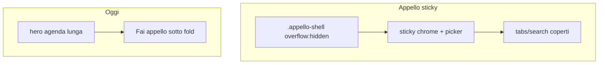

# Piano: usabilità mobile (da test reale)

Verifica su `localhost:4173` a **390×844** (sessione loggata). Brand/token invariati; file [`index.html`](index.html).

## Problemi emersi dal test

1. **Bug Appello** — con messe il 27/09, lo sticky `.appello-sticky-chrome` **sovrappone** tabs/search (~33px). Causa: `.appello-shell { overflow: hidden }` rompe lo sticky.
2. **Oggi** — hero ~513px (tutto il weekend); «Fai appello» quasi sotto il fold. Strip stats a 0 poco utile nei giorni senza messa.
3. **Appello vuoto (oggi feriale)** — messaggio ripetuto 2–3 volte; barra Salva sempre presente senza lista da segnare.
4. **Messe** — legenda + summary + filtri occupano ~half viewport prima della lista; checkbox «Mostra messe passate» / «Vai a oggi» sotto i 44px.
5. **Anagrafica** — lista-first ok; filtri stacked ok per ora (fuori scope stretto).

## Fix (priorità)

### 1. Appello: sticky senza overlap
- Su `.appello-shell`: `overflow-x: hidden; overflow-y: visible` (o `visible`)
- Verificare che shadow sticky non tagli; se serve, `padding-bottom` minimo sul chrome
- Compattare un filo picker/stats su ≤768 se chrome > ~180px

### 2. Oggi: CTA in prima viewport
- Limite messe nell’hero (es. **prossima + max 2–3** successive) + link «Vedi tutta l’agenda» già presente
- Su mobile: strip stats **dopo** le quick-actions (ordine CSS `order`), così «Fai appello» arriva subito sotto un hero più corto

### 3. Appello empty / save bar
- Un solo empty-state chiaro + CTA agenda (niente triplo «Nessuna messa…»)
- Nascondere `.appello-save-bar` se non c’è nessuno da segnare (lista vuota / solo empty)

### 4. Messe mobile densità
- Legenda collassabile o a riga singola scrollabile ≤768
- Toolbar più compatta; `cal-filter` / «Vai a oggi» a min-height 44px

## Fuori scope
Auth restyle, modal al posto di `confirm`, nuove feature, Anagrafica filtri.

## Verifica
Ricaricare 390px: Appello 27/09 senza overlap tabs; Oggi con Appello in vista senza scroll lungo; feriale senza barra Salva inutile; Messe con lista raggiungibile in pochi scroll.
